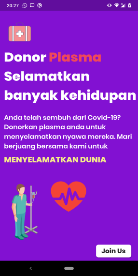
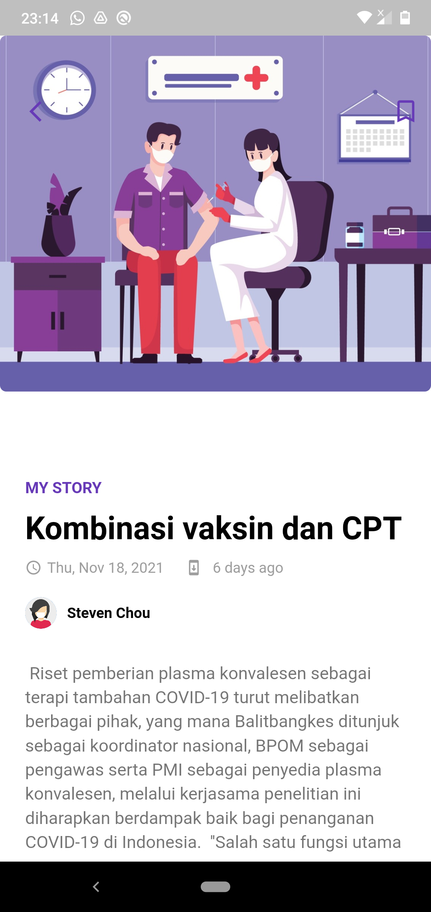
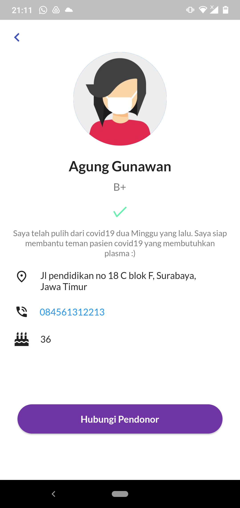
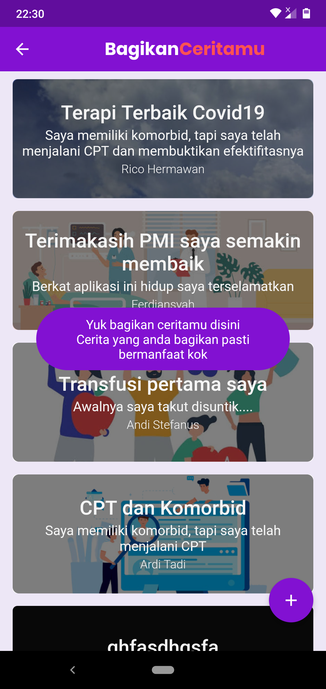

<!-- 

 -->

# Hello :wave:

Welcome to **Donor Plasma Konvalesen** project. As we all know, we are facing a global pandemic named as COVID-19. Scientists are trying to discover vaccines to cure people affected with corona virus. In this critical situation different types of treatments are given by different doctors. Some doctors recommended plasma therapy for the patient who is in the critical situation. In this situation it is difficult for a patient to find a donor as everybody can’t donate plasma.

## What is plasma? Why plasma is needed to cure corona virus patients?

**Plasma** is the clear, straw-colored liquid portion of blood that remains after red blood cells, white blood cells, platelets and other cellular components are removed. In **Convalescent Plasma Therapy (CPT)**, plasma collected from recovered patients is infused into patients who currently have the disease.

CPT is, by far, the oldest treatment being tested to battle COVID-19, being successful in cases during the previous corona virus outbreaks such as the Sars epidemic in 2003 and the Ebola virus outbreak in 2013. Physicians used CPT effectively before the specific treatment was developed for H1N1 influenza (Spanish virus), SARS-1 and MERS virus.

## Our project goal

The main goal of our project is to make it easier for the COVID-19 patients to get a plasma donor easily and as soon as possible as it is too much difficult to find a plasma donor. In most of the case, it has seen that COVID-19 patients look for plasma in facebook group or just by posting randomly which in some case is not helpful. Here our project will help the patient to find a donor fast when they need.

## Work flow of the project

The person who wants to donate his/her plasma need to register and create his/her profile first in our application providing required information which are name, blood group, phone number and location. He/She can also share his/her winning story against corona virus to motivate others.

Patients who need plasma don't need to create account. They can look for a donor from the home page. Patients can directly call the donor from the application by clicking on the dial button. Patients can also read the corresponding donor's story.

## Technology/ Stack used

- **Mobile framework**: Flutter v1.17.4
- **Architecture**: Provider Pattern
- **CI/CD**: Github Actions

## Achievement :tada: :raised_hands:

Thanks to Almighty Allah, we got ourselves **Runner up** position. Yes you read it right!. We submitted this project in the Flutter International Hackathon #Hack20 where 650 teams all over the world participated and submitted 266 projects. After 2 rounds of voting phase, our project has been selected as one of the top three. All thanks to Allah and our dedicated team members who really worked hard and got this achievement. [Winning moment video](screenshots/video/Winning%20moment%20Video.mp4)

## Screenshots & Gif

Here are some screenshots of our project

**Screenshots**

|                    BANNER                     |                    HOME PAGE                     |                 DONOR STORY                  |
| :-------------------------------------------: | :----------------------------------------------: | :------------------------------------------: |
|  |  |  |

|                  ADMIN PAGE                   |                 DONOR PROFILE                  |                 SHARE STORY                  |
| :-------------------------------------------: | :--------------------------------------------: | :------------------------------------------: |
|  |  |  |

**Application gif**

## Found a problem

If you find any problem, bug (:beetle:) or want to share any kind of suggestions to improve our work please let us know by creating an [issue here.](https://github.com/Andreas-Earsadn/flutter_donor_plasma_konvalesen/issues)

## Contributors

<table>
  <tr>
   <td align="center"><a href="https://facebook.com/anecdotalizard"> <b>Andreas-Earsadn</b></a> <a href="#" title="Ideas">🤩</a><a href="#" title="Code">💻</a></td>
   
  </tr>
  </table>

## If you like our work please give us a :star:, it will motivate us to do more awesome work :blush:
