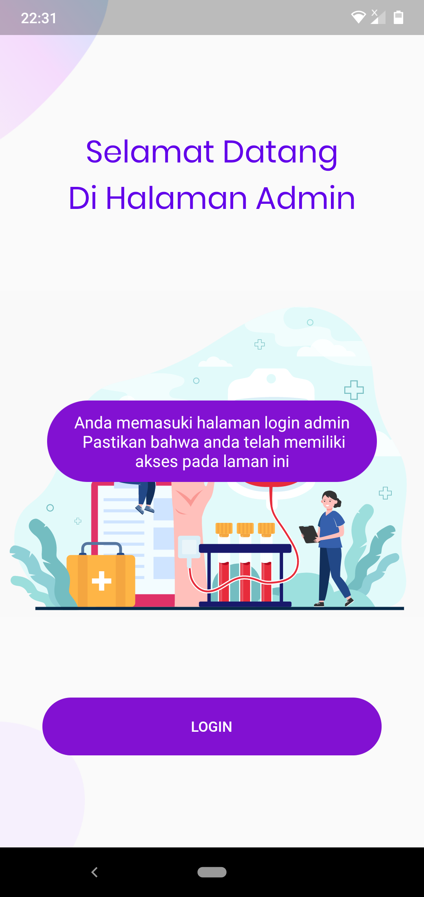

<!-- 

 -->

# Hello :wave:

Welcome to **Donor Plasma Konvalesen** project. Convalescent refers to anyone recovering from a disease. Convalescent plasma from patients who have already recovered from coronavirus disease 2019 (COVID-19) may contain antibodies against COVID-19. Giving this convalescent plasma to hospitalized people currently fighting COVID-19 may help them recover

## Plasma
In the blood plasma, there are antibodies that appear in response to the body when infected with a virus or bacteria, including the Corona virus. Enough antibodies can eradicate the virus that causes COVID-19. CPT is, by far, the oldest treatment being tested to battle COVID-19, being successful in cases during the previous corona virus outbreaks such as the Sars epidemic in 2003 and the Ebola virus outbreak in 2013. Physicians used CPT effectively before the specific treatment was developed for H1N1 influenza (Spanish virus), SARS-1 and MERS virus.

## Our project goal

The main goal of Donor Plasma Konvalesen app is to make donor The main goal of this project is to make it easier for COVID-19 patients and donors to meet for plasma transfusions. Applications become a liaison between donors and patients.

## Technology/ Stack used

- **Mobile framework**: Flutter v1.17.4
- **Architecture**: Provider Pattern
- **CI/CD**: Github Actions

## Screenshots

**Screenshots**

|                    BANNER                     |                    HOME PAGE                     |                 DONOR LIST                  |
| :-------------------------------------------: | :----------------------------------------------: | :------------------------------------------: |
|         | |         |

|                  ADMIN PAGE                   |                 DONOR PROFILE                    |                 SHARE STORY                  |
| :-------------------------------------------: | :--------------------------------------------:   | :------------------------------------------: |
|          |        |     |
|                    BANNER                     |                    HOME PAGE                     |                 DONOR STORY                  |
| :-------------------------------------------: | :----------------------------------------------: | :------------------------------------------: |
|         |          |         |

|                  WELCOME ADMIN                   |                 LOGIN ADMIN                   |                 CRUD ADMIN                |
| :-------------------------------------------: | :--------------------------------------------:   | :------------------------------------------: |
|          |        |     |
|                    DONOR STORY                   |        STORIES CCOLLECTION                    |                 CREATE STORY                  |
| :-------------------------------------------: | :----------------------------------------------: | :------------------------------------------: |
|         |          |         |

|                  DONOR FORM 1                   |                 DONOR FORM 2                    |                 FAQ                  |
| :-------------------------------------------: | :--------------------------------------------:   | :------------------------------------------: |
|          |        |     |

**Application gif**

## Found a problem

If you find any problem, bug (:beetle:) or want to share any kind of suggestions to improve our work please let us know by creating an [issue here.](https://github.com/Andreas-Earsadn/flutter_donor_plasma_konvalesen/issues)

## Contributors

<table>
  <tr>
   <td align="center"><a href="https://facebook.com/anecdotalizard"> <b>Andreas-Earsadn</b></a> <a href="#" title="Ideas">🤩</a><a href="#" title="Code">💻</a></td>
   
  </tr>
  </table>

## If you like our work please give us a :star:, it will motivate us to do more awesome work :blush:
